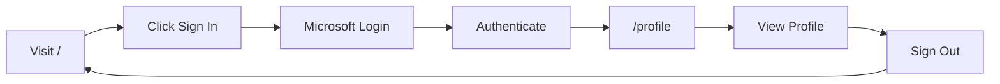
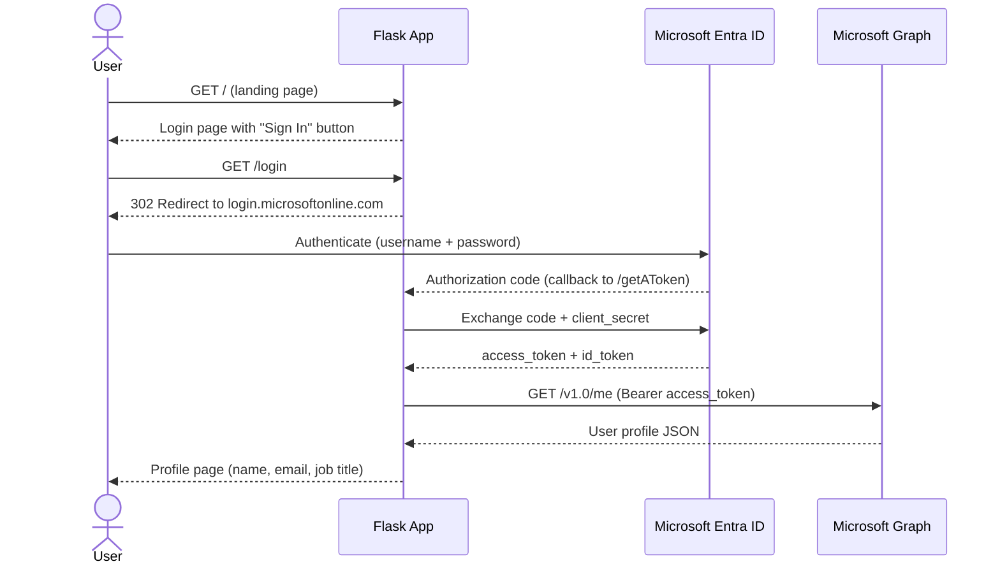
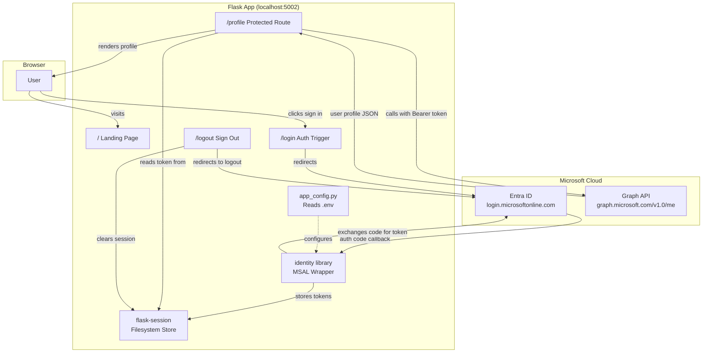

#  Python Auth POC

A Flask web app that authenticates users via Microsoft Entra ID (Azure AD) and displays their profile from Microsoft Graph.

## Prerequisites

- Python 3.10+
- An Azure subscription with access to Microsoft Entra ID

## 1. Register an App in Microsoft Entra ID

1. Go to [Azure Portal](https://portal.azure.com) → **Microsoft Entra ID** → **App registrations** → **New registration**
2. Fill in:
   - **Name**: `Python Auth POC` (or any name)
   - **Supported account types**: *Accounts in this organizational directory only* (single-tenant)
   - **Redirect URI**: Platform = **Web**, URI = `http://localhost:5002/getAToken`
3. Click **Register**
4. From the **Overview** page, copy:
   - **Application (client) ID**
   - **Directory (tenant) ID**
5. Go to **Certificates & secrets** → **New client secret**
   - Add a description, choose an expiry, and click **Add**
   - **Copy the secret Value immediately** (it's only shown once)
6. Go to **API permissions** → confirm **Microsoft Graph → User.Read (Delegated)** is listed (added by default)
7. Go to **Authentication** → ensure **ID tokens** is checked under *Implicit grant and hybrid flows*

## 2. Clone and Set Up

```bash
git clone <repo-url>
cd python-auth-poc
```

Create and activate a virtual environment:

```bash
# Windows
python -m venv .venv
.venv\Scripts\activate

# macOS/Linux
python3 -m venv .venv
source .venv/bin/activate
```

Install dependencies:

```bash
pip install -r requirements.txt
```

## 3. Configure Environment Variables

Create a `.env` file in the project root (or edit the existing one):

```env
CLIENT_ID=<your Application (client) ID>
CLIENT_SECRET=<your client secret Value>
TENANT_ID=<your Directory (tenant) ID>
FLASK_SECRET_KEY=<a random hex string>
```

> **What is `FLASK_SECRET_KEY`?**
> This is a random string used by Flask to cryptographically sign session cookies. It prevents users from tampering with session data (which stores your auth tokens). It has nothing to do with Azure — it's purely a Flask setting. Generate any long random value and keep it secret.

To generate a `FLASK_SECRET_KEY`:

```bash
python -c "import secrets; print(secrets.token_hex(32))"
```

## 4. Run the App

```bash
python app.py
```

The app starts at **http://localhost:5002**.

## 5. Usage

| Route | Description |
|-------|-------------|
| `/` | Landing page with a "Sign in with Microsoft" button |
| `/login` | Initiates the Entra ID login flow |
| `/profile` | Displays your Microsoft Graph profile (name, email, job title, office). Requires authentication. |
| `/logout` | Signs you out and redirects to the landing page |

### Flow



## Project Structure

```
python-auth-poc/
├── .env                  # Environment variables (not committed)
├── .gitignore
├── app.py                # Flask app with auth routes
├── app_config.py         # Configuration (reads from .env)
├── requirements.txt      # Python dependencies
└── templates/
    ├── index.html        # Profile page (post-login)
    └── login.html        # Landing page with sign-in button
```

## Troubleshooting

| Issue | Fix |
|-------|-----|
| `AADSTS50011: The redirect URI does not match` | Ensure `http://localhost:5002/getAToken` is registered as a Web redirect URI in your app registration |
| `AADSTS7000215: Invalid client secret` | Regenerate the client secret and update `.env` |
| Device Code Flow instead of browser redirect | Make sure `REDIRECT_URI` is set in `app_config.py` (not `None`) |
| Session errors or cookie too large | The app uses filesystem sessions via `flask-session` — ensure the `flask_session/` directory is writable |

## Libraries Used

| Library | Version | Purpose |
|---------|---------|---------|
| [Flask](https://flask.palletsprojects.com/) | 3.x | Lightweight Python web framework. Handles routing, request/response, and template rendering via Jinja2. |
| [identity\[flask\]](https://github.com/Azure-Samples/ms-identity-python-utilities) | 0.11+ | Microsoft's official high-level authentication library for Flask. Built on top of MSAL (Microsoft Authentication Library). Handles the full OAuth 2.0 Authorization Code Flow, token caching, and session management. |
| [flask-session](https://flask-session.readthedocs.io/) | 0.8+ | Server-side session storage for Flask. Stores session data on the filesystem instead of in cookies, which is necessary because MSAL token caches exceed cookie size limits. |
| [python-dotenv](https://github.com/theskumar/python-dotenv) | 1.x | Reads key-value pairs from a `.env` file and sets them as environment variables. Keeps secrets out of source code. |
| [requests](https://requests.readthedocs.io/) | 2.x | HTTP client used to call the Microsoft Graph API (`/v1.0/me`) to fetch the authenticated user's profile. |

## How the Code Works

### Authentication Flow

This app uses the **OAuth 2.0 Authorization Code Flow** — a server-side flow where the client secret never leaves the backend.



### Architecture



### Key Files

#### `app.py` — Main Application

- Creates the Flask app and initialises `identity.flask.Auth` with the Entra credentials and redirect URI.
- **`/`** — Renders the landing page (`login.html`) with a sign-in button.
- **`/login`** — Calls `auth.login()` which renders Microsoft's sign-in page. After successful authentication, the user is redirected to `/profile`.
- **`/profile`** — Protected by `@auth.login_required(scopes=["User.Read"])`. The decorator handles unauthenticated users automatically (redirects them to login). On success, it injects a `context` dict containing the `user` object and `access_token`. The route uses the token to call the Graph API and render the profile.
- **`/logout`** — Calls `auth.logout()` which clears the server-side session and redirects to Microsoft's logout endpoint.

#### `app_config.py` — Configuration

- Uses `python-dotenv` to load secrets from `.env`.
- Constructs the `AUTHORITY` URL from the tenant ID: `https://login.microsoftonline.com/{TENANT_ID}`.
- Defines `REDIRECT_URI` as `http://localhost:5002/getAToken` — this must match what's registered in the Entra app registration.
- Sets `SESSION_TYPE = "filesystem"` so `flask-session` stores tokens on disk.

#### `templates/login.html` — Landing Page

- Simple page with a "Sign in with Microsoft" button that links to `/login`.

#### `templates/index.html` — Profile Page

- Displays the signed-in user's display name, email, job title, and office location from the Graph API response.
- Includes a "Sign out" link.

### Why `identity[flask]` Instead of Raw MSAL

The `identity` library wraps MSAL and handles boilerplate that you'd otherwise write manually:

- **Token cache**: Automatically stores and retrieves tokens from the server-side session.
- **Callback route**: Registers the `/getAToken` callback route to handle the authorization code exchange.
- **`@login_required` decorator**: Protects routes, handles redirects for unauthenticated users, and injects the token context.
- **Logout**: Handles both local session cleanup and Microsoft's logout endpoint.

Using raw `msal` directly would require ~100+ additional lines of code for the same functionality.
